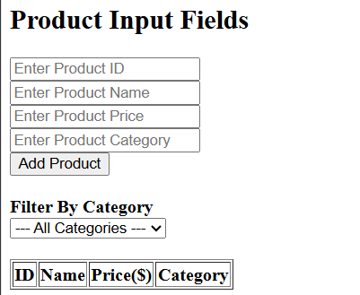
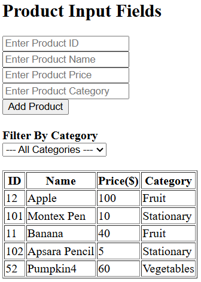

# 📝 Dynamic Product Filter with Dropdown using JavaScript DOM Manipulation

## 🎯 Objective

Build a web-based product list that can dynamically filter and display items based on the user's selection from a dropdown menu. This task helps you understand how to use JavaScript to manipulate the DOM, handle events, and update visible elements in real time.

## 📋 Task Description

Create a web page that displays a list of products (for example, shoes, shirts, or gadgets).  
Above the product list, include a dropdown menu with filter options such as **"All"**, **"Category 1"**, **"Category 2"**, etc.  

When the user selects an option from the dropdown, the product list should update immediately to show only the items that match the selected category.  

If **"All"** is selected, all products should be displayed.  

The filtering and display changes must happen **dynamically using JavaScript without reloading the page**.

### HTML5 [View Code](main.html)
```html
<!DOCTYPE html>
<html lang="en">
<head>
    <meta charset="UTF-8">
    <meta name="viewport" content="width=device-width, initial-scale=1.0">
    <title>Product Lists</title>
</head>
<body>
    <h2>Product Input Fields</h2>
    <input type="number" id="productid" placeholder="Enter Product ID"><br>
    <input type="text" id="productname" placeholder="Enter Product Name"><br>
    <input type="number" id="productprice" placeholder="Enter Product Price"><br>
    <input type="text" id="productcategory" placeholder="Enter Product Category"><br>

    <input type="button" value="Add Product" onclick="addproductlist()"><br><br>

    <label for="categoryDropdown"><b>Filter By Category</b></label><br>
    <select id="categoryDropdown" onchange="filterbycategory()">
        <option value="all">--- All Categories ---</option>
    </select>
    <br><br>

    <table border="1" id="productTable">
        <thead>
            <tr>
                <th>ID</th>
                <th>Name</th>
                <th>Price($)</th>
                <th>Category</th>
            </tr>
        </thead>
        <tbody id="producttablebody"></tbody>
    </table>

<script>
    let products = [];
    let categories = new Set();

    function addproductlist(){
        let id = document.getElementById('productid').value;
        let name = document.getElementById('productname').value;
        let price = document.getElementById('productprice').value;
        let category = document.getElementById('productcategory').value;

        if(!id || !name || !price || !category){
            alert("Please fill all fields!");
            return;
        }

        let product = { id, name, price, category };
        products.push(product);

        if (!categories.has(category)) {
            categories.add(category);
            let option = document.createElement('option');
            option.value = category;
            option.text = category;
            document.getElementById('categoryDropdown').appendChild(option);
        }

        displayproducts(products);

        document.getElementById('productid').value="";
        document.getElementById('productname').value="";
        document.getElementById('productprice').value="";
        document.getElementById('productcategory').value="";
    }

    function displayproducts(list){
        const tbody = document.getElementById("producttablebody");
        tbody.innerHTML = "";
        list.forEach(p => {
            let row = `<tr>
                <td>${p.id}</td>
                <td>${p.name}</td>
                <td>${p.price}</td>
                <td>${p.category}</td>
            </tr>`;
            tbody.innerHTML += row;
        });
    }

    function filterbycategory(){
        let selected = document.getElementById('categoryDropdown').value;
        if(selected === "all"){
            displayproducts(products);
        } else {
            let filtered = products.filter(p => p.category === selected);
            displayproducts(filtered);
        }
    }
</script>
</body>
</html>
```

## 📸 Screenshot - Output



## Learning Outcome
- Gain experience with real-time **DOM event handling**.
- Practice **updating UI dynamically** with JavaScript.
- Improve **user interaction feedback** using simple logic.
